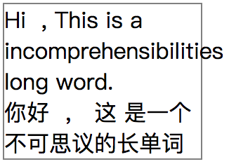
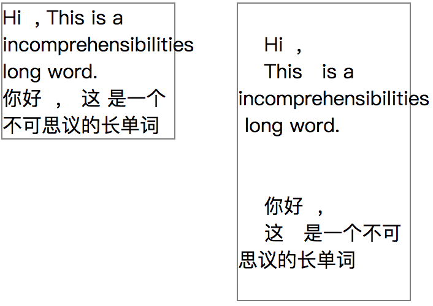
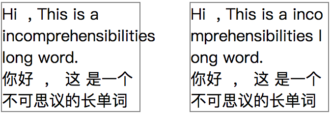

## 超出一行用省略号显示：

``` css
overflow: hidden;/*超出部分隐藏*/
white-space: nowrap;/*不换行*/
text-overflow:ellipsis;/*超出部分文字以...显示*/
```


## 彻底搞懂word-break、word-wrap、white-space

white-space、word-break、word-wrap（overflow-wrap）估计是css里最基本又最让人迷惑的三个属性了，我也是用了n次都经常搞混，必须系统整理一下，今天我们就把这三个属性彻底搞清楚！

## 测试代码

**(文末有本文中所有例子的代码)**
下面是本文中用于测试三个样式属性展现情况的html代码：

```html
<div id="box">
  Hi&nbsp;&nbsp;,
  This   is a incomprehensibilities long word.
  </br>
  你好&nbsp;&nbsp;，
  这   是一个不可思议的长单词
</div>复制代码
```

现在只给了它一个宽度和边框，没有其它任何样式，下面是它目前的展现情况：



可以看到，`nbsp;`和`</br>`可以正常发挥作用，而连续的空格会被缩减成一个（比如This和is之间的三个空格变成了一个），换行符也全都无效。句子超过一行后会自动换行，而长度超过一行的单个单词会超出边界。

接下来我们看下， 给它上面三个css属性赋值后会出现什么变化。


## white-space

正如它的名字，**这个属性是用来控制空白字符的显示的**，同时还能控制是否自动换行。它有五个值：`normal | nowrap | pre | pre-wrap | pre-line`。因为默认是`normal`，所以我们主要研究下其它四种值时的展现情况。

（为了方便比较，下文所有图，左侧为`normal`即初始情况，右侧为赋上相应值时的情况）

先看下`white-space:nowrap`时的情况：


不仅空格被合并，换行符无效，连原本的自动换行都没了！只有`</br>`才能导致换行！所以这个值的表现还是挺简单的，我们可以理解为`永不换行`。

`white-space:pre`：


空格和换行符全都被保留了下来！不过自动换行还是没了。保留，所以`pre`其实是`preserve`的缩写，这样就好记了。

`white-space:pre-wrap`：




显然`pre-wrap`就是`preserve`+`wrap`，保留空格和换行符，且可以自动换行。

`white-space:pre-line`：


空格被合并了，但是换行符可以发挥作用，`line`应该是`new line`的意思，自动换行还在，所以`pre-line`其实是`preserve`+`new line`+`wrap`。

**我整理了一个表予以总结：**

| 是否能发挥作用 | 换行符 | 空格      | 自动换行 | </br>、nbsp; |
| -------------- | ------ | --------- | -------- | ------------ |
| normal         | ×      | ×（合并） | √        | √            |
| nowrap         | ×      | ×（合并） | ×        | √            |
| pre            | √      | √         | ×        | √            |
| pre-wrap       | √      | √         | √        | √            |
| pre-line       | √      | ×（合并） | √        | √            |


## word-break

从这个名字可以知道，**这个属性是控制单词如何被拆分换行的**。它有三个值：`normal | break-all | keep-all`。

`word-break:keep-all`：


**所有“单词”一律不拆分换行**，注意，我这里的“单词”包括连续的中文字符（还有日文、韩文等），或者可以理解为**只有空格可以触发自动换行**

`word-break:break-all`：




**所有单词碰到边界一律拆分换行**，不管你是`incomprehensibilities`这样一行都显示不下的单词，还是`long`这样很短的单词，只要碰到边界，都会被强制拆分换行。所以用`word-break:break-all`时要慎重呀。


这样的效果好像并不太好呀，能不能就把incomprehensibilities拆一下，其它的单词不拆呢？那就需要下面这个属性了：


## word-wrap（overflow-wrap）

`word-wrap`又叫做`overflow-wrap`：

> word-wrap 属性原本属于微软的一个私有属性，在 CSS3 现在的文本规范草案中已经被重名为 overflow-wrap 。 word-wrap 现在被当作 overflow-wrap 的 “别名”。 稳定的谷歌 Chrome 和 Opera 浏览器版本支持这种新语法。

**这个属性也是控制单词如何被拆分换行的**，实际上是作为`word-break`的互补，它只有两个值：`normal | break-word`，那我们看下`break-word`：


终于达到了上文我们希望的效果，**只有当一个单词一整行都显示不下时，才会拆分换行该单词**。
所以我觉得`overflow-wrap`更好理解好记一些，overflow，只有长到溢出的单词才会被强制拆分换行！

（其实前面的`word-break`属性除了列出的那三个值外，也有个`break-word`值，效果跟这里的`word-wrap:break-word`一样，然而只有Chrome、Safari等部分浏览器支持）


## 总结

最后总结一下三个属性

- white-space，**控制空白字符的显示**，同时还能控制是否自动换行。它有五个值：`normal | nowrap | pre | pre-wrap | pre-line`
- word-break，**控制单词如何被拆分换行**。它有三个值：`normal | break-all | keep-all`
- word-wrap（overflow-wrap）**控制长度超过一行的单词是否被拆分换行**，是`word-break`的补充，它有两个值：`normal | break-word`

相信读完了本文，你应该对white-space、word-break、word-wrap有比较系统的认识了吧。


下面是本文里所有例子的代码的地址，每个属性做成了选项，方便操作学习~

https://codepen.io/YGYOOO/pen/jvyrWK