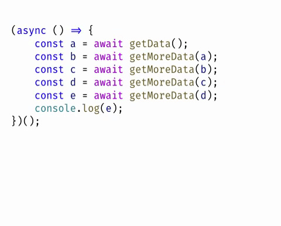

## 定义

### async

async function 用来定义一个返回 AsyncFunction 对象的异步函数。异步函数是指通过事件循环异步执行的函数，它会通过一个隐式的 Promise 返回其结果。如果你在代码中使用了异步函数，就会发现它的语法和结构会更像是标准的同步函数。

### await

异步函数可以包含await指令，该指令会暂停异步函数的执行，并等待Promise执行，然后继续执行异步函数，并返回结果。

记住，await 关键字只在异步函数内有效。如果你在异步函数外使用它，会抛出语法错误。

注意，当异步函数暂停时，它调用的函数会继续执行(收到异步函数返回的隐式Promise)

``` js
function resolveAfter2Seconds() {
  return new Promise(resolve => {
    setTimeout(() => {
      resolve('resolved');
    }, 2000);
  });
}

async function asyncCall() {
  console.log('calling');
  var result = await resolveAfter2Seconds();
  console.log(result);
  // expected output: 'resolved'
}

asyncCall();

```

### async/await 诞生的初衷（是要解决什么问题？）

“async/await是为了简化多个Promise的同步操作，就像Promise要解决层层嵌套的回调函数的问题一样

所以async/await就是要完善Promise还不够完美的地方，是在Promise的基础上进行改进的，因此也很好理解为什么await只能“等待”Promise对象。


async/await是在Promise之后产生的，它和Promise诞生的目的都是为了解决“回调地狱”，至于什么是回调地狱：


Promise改进后：


async/await改进后：




