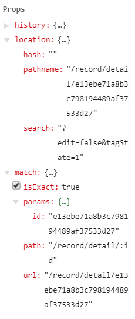

官网：https://reacttraining.com/react-router/web/guides/quick-start

🌟接口API：https://blog.csdn.net/sinat_17775997/article/details/69218382
# React-router和React-router-dom的选择
很多刚使用react的同学在接触到react-router的时候就会很蛋疼，什么react-router和react-router-dom？往往开始会比较懵逼。下面我们就来一探究竟。
### React-router
React-router提供了一些router的核心api，包括Router, Route, Switch等，但是它没有提供dom操作进行跳转的api。
### React-router-dom
React-router-dom提供了BrowserRouter, Route, Link等api,我们可以通过dom的事件控制路由。例如点击一个按钮进行跳转，大多数情况下我们是这种情况，所以在开发过程中，我们更多是使用React-router-dom。安装很简单npm i react-router-dom --save,安装了淘宝镜像的就用cnpm吧。

# React-router-dom的核心用法
## HashRouter和BrowserRouter
它们两个是路由的基本，就像盖房子必须有地基一样，我们需要将它们包裹在最外层，我们只要选择其一就可以了。现在讲它们的不同：
### HashRouter
如果你使用过react-router2或3或者vue-router，你经常会发现一个现象就是url中会有个#，例如localhost:3000/#，HashRouter就会出现这种情况，它是通过hash值来对路由进行控制。如果你使用HashRouter，你的路由就会默认有这个#。

举例：`localhost:3000/#/`

这就是HashRouter的使用情况。下面是对应的代码。

``` jsx
import React from 'react';
import ReactDom from 'react-dom';
import { BrowserRouter, HashRouter, Route } from 'react-router-dom';

function home() {
  return <h2>Home Page</h2>
}
ReactDom.render(
  <HashRouter>
    <Route path="/" component={home}></Route>
  </HashRouter>, document.getElementById('root'));
)
```

### BrowserRouter
很多情况下我们则不是这种情况，我们不需要这个#，因为它看起来很怪，这时我们就需要用到BrowserRouter。

举例：`localhost:3000`

``` jsx
<BrowserRouter>
  <Route path="/" component={home}></Route>
</BrowserRouter>
```

它的原理是使用HTML5 history API (pushState, replaceState, popState)来使你的内容随着url动态改变的， 如果是个强迫症或者项目需要就选择BrowserRouter吧。下面我们将主要结合它来讲解。
这里讲一个它们的基础api，basename。如果你的文件放在服务器的二级目录下则可以使用它。

``` jsx
<BrowserRouter basename="/calendar">
  <Route path="/" component={home}></Route>
</BrowserRouter>
```

它的效果如下图,当你的主页前面是有一级目录calendar时，同样会显示主页的内容。它常常配合Link使用。

图：`localhost:3000/calendar`

##Route
Route是路由的一个原材料，它是控制路径对应显示的组件。我们经常用的是exact、path以及component属性。

``` jsx
<Route exact path="/" component={Home}></Route>
<Route path="/second" component={Second}></Route>
<Route path="/third" component={Third}></Route>
```

exact控制匹配到/路径时不会再继续向下匹配，path标识路由的路径，component表示路径对应显示的组件。后面我们将结合NavLink完成一个很基本的路由使用。同时我们可以设置例如/second/:id的方式来控制页面的显示，这需要配合Link或者NavLink配合使用。下面我们会提到

## Link和NavLink的选择
两者都是可以控制路由跳转的，不同点是NavLink的api更多，更加满足你的需求。
### Link
主要api是to，to可以接受string或者一个object，来控制url。使用方法如下

``` jsx
import { Link } from 'react-router-dom';

<Link to="/about">About</Link>
<Link to="/courses?sort=name" />
<Link
  to={{
    pathname: "/courses",
    search: "?sort=name",
    hash: "#the-hash",
    state: { fromDashboard: true }
  }}
/>
```

这时点击Link就会跳转到courses。
### NavLink
它可以为当前选中的路由设置类名、样式以及回调函数等。使用如下

``` jsx
import { NavLink } from 'react-router-dom';

<NavLink to="/about">About</NavLink>
<NavLink exact to="/faq" activeClassName="selected">
  FAQs
</NavLink>
<NavLink
  to="/faq"
  activeStyle={{
    fontWeight: "bold",
    color: "red"
  }}
>
  FAQs
</NavLink>
```

exact用于严格匹配，匹配到/则不会继续向下匹配，to则是控制跳转的路径，activeClassName是选中状态的类名，我们可以为其添加样式。



## 对象和方法

### history

histoty 是 RR4 的两大重要依赖之一（另一个当然是 React 了），在不同的 javascript 环境中， history 以多种能够行驶实现了对会话（session）历史的管理。

我们会经常使用以下术语：

- "browser history" - history 在 DOM 上的实现，用于支持 HTML5 history API 的浏览器
- "hash history" - history 在 DOM 上的实现，用于旧版浏览器。
- "memory history" - history 在内存上的实现，用于测试或非 DOM 环境（例如 React Native）。

history 对象通常具有以下属性和方法：

- length: number 浏览历史堆栈中的条目数
- action: string 路由跳转到当前页面执行的动作，分为 PUSH, REPLACE, POP
- location: object 当前访问地址信息组成的对象，具有如下属性：
  - pathname: string URL路径
  - search: string URL中的查询字符串
  - hash: string URL的 hash 片段
  - state: string 例如执行 push(path, state) 操作时，location 的 state 将被提供到堆栈信息里，state 只有在 browser 和 memory history 有效。
- push(path, [state]) 在历史堆栈信息里加入一个新条目。
- replace(path, [state]) 在历史堆栈信息里替换掉当前的条目
- go(n) 将 history 堆栈中的指针向前移动 n。
- goBack() 等同于 go(-1)
- goForward 等同于 go(1)
- block(prompt) 阻止跳转

history 对象是可变的，因为建议从 `<Route>` 的 prop 里来获取 location，而不是从 history.location 直接获取。这样可以保证 React 在生命周期中的钩子函数正常执行，例如以下代码：

```javascript
class Comp extends React.Component {
  componentWillReceiveProps(nextProps) {
    // locationChanged
    const locationChanged = nextProps.location !== this.props.location
 
    // 错误方式，locationChanged 永远为 false，因为history 是可变的
    const locationChanged = nextProps.history.location !== this.props.history.location
  }
}
```

### location

location 是指你当前的位置，将要去的位置，或是之前所在的位置

``` js
{
  key: 'ac3df4', // not with HashHistory!
  pathname: '/somewhere'
  search: '?some=search-string',
  hash: '#howdy',
  state: {
    [userDefined]: true
  }
}
```

在以下情境中可以获取 location 对象

- 在 `Route component` 中，以 this.props.location 获取
- 在 `Route render` 中，以 ({location}) => () 方式获取
- 在 `Route children` 中，以 ({location}) => () 方式获取
- 在 `withRouter` 中，以 this.props.location 的方式获取

location 对象不会发生改变，因此可以在生命周期的回调函数中使用 location 对象来查看当前页面的访问地址是否发生改变。这种技巧在获取远程数据以及使用动画时非常有用。

``` js
componentWillReceiveProps(nextProps) {
  if (nextProps.location !== this.props.location) {
    // 已经跳转了！
  }
}
```

可以在不同情境中使用 location：

- `<Link to={location} />`
- `<NaviveLink to={location} />`
- `<Redirect to={location />`
- history.push(location)
- history.replace(location)

### match

- match 对象包含了 <Route path> 如何与 URL 匹配的信息，具有以下属性：

  - params: object 路径参数，通过解析 URL 中的动态部分获得键值对
  - isExact: bool 为 true 时，整个 URL 都需要匹配
  - path: string 用来匹配的路径模式，用于创建嵌套的 <Route>
  - url: string URL 匹配的部分，用于嵌套的 <Link>

  在以下情境中可以获取 match 对象

  - 在 `Route component` 中，以 this.props.match获取
  - 在 `Route render` 中，以 ({match}) => () 方式获取
  - 在 `Route children` 中，以 ({match}) => () 方式获取
  - 在 `withRouter` 中，以 this.props.match的方式获取
  - matchPath 的返回值

  当一个 Route 没有 path 时，它会匹配一切路径。
